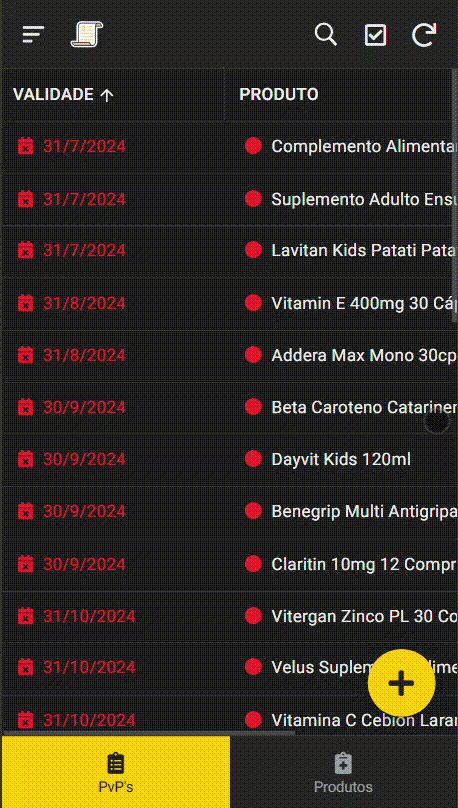
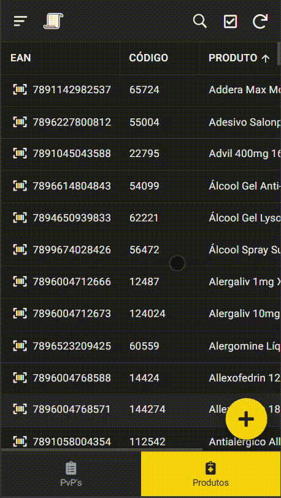
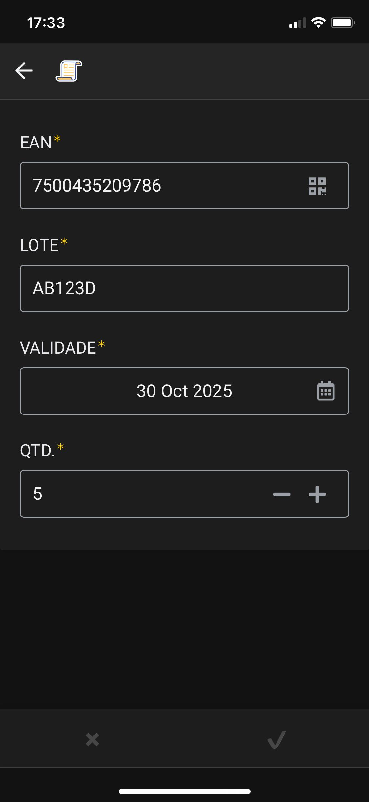
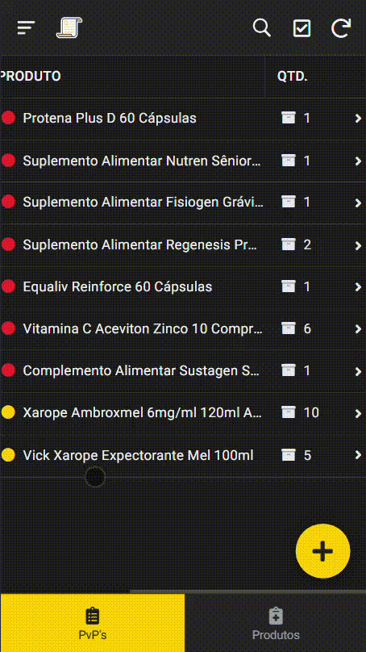
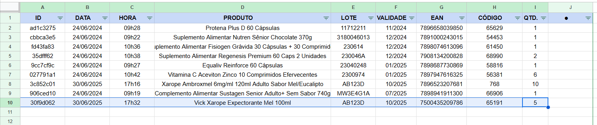
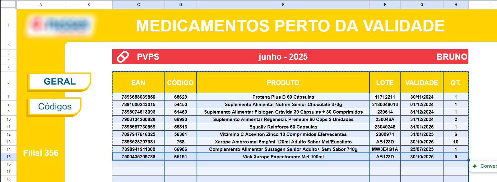
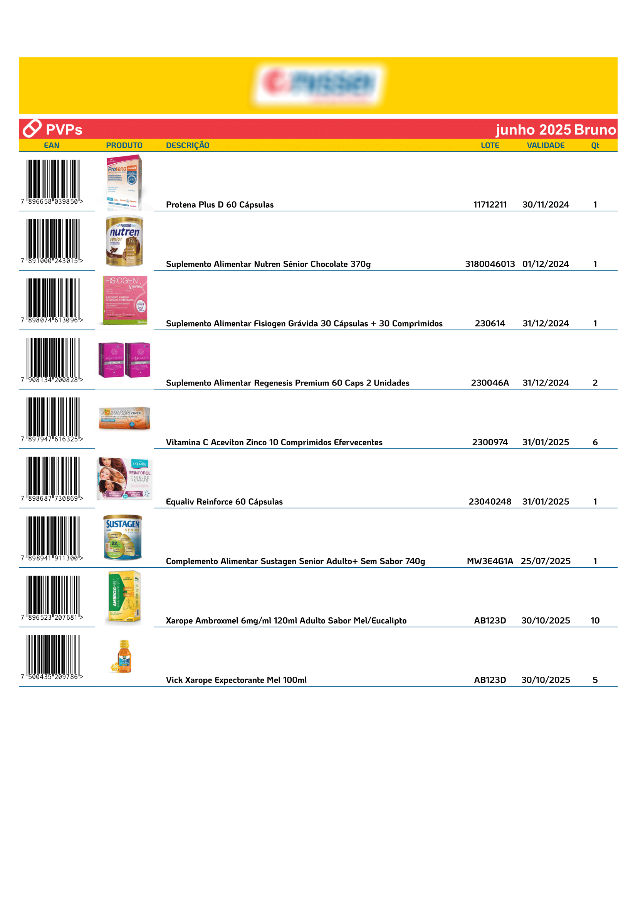

# 📦 Controle de Validade de Produtos (PVPS)

Este projeto automatiza o controle de vencimento de medicamentos e produtos em estoque, substituindo o processo manual (feito em papel) por uma solução digital baseada em AppSheet e Google Sheets.

Foi desenvolvido voluntariamente por mim, sem vínculo formal com a farmácia onde trabalhei, com o objetivo de facilitar o dia a dia da equipe e reduzir erros em auditorias e conferências.

---

## 🎯 Objetivo

Facilitar e agilizar o processo de verificação e controle de validade (PVPS) em estabelecimentos como farmácias, minimizando o uso de papel e aumentando a precisão das informações.

---

## ⚙️ Funcionalidades

- Escaneamento de código de barras com o celular
- Cadastro e atualização de datas de validade
- Registro automático dos dados no Google Sheets
- Alerta visual para produtos próximos ao vencimento:
  - 🔴 Vermelho: vencidos ou com validade inferior a 3 meses
  - 🟡 Amarelo: validade entre 3 e 6 meses
- Aprendizado automático: o sistema reconhece produtos digitados manualmente após o primeiro registro
- Impressão facilitada do PVPS físico para auditorias

---

## 🧠 Desafios e Soluções

| Desafio                                           | Solução                                                                 |
|--------------------------------------------------|------------------------------------------------------------------------|
| Produtos escaneados sem nome                     | Lógica de "aprendizado" com base em preenchimento manual ou automatizada uma única vez |
| Adesão de equipe sem perfil técnico              | Interface intuitiva e fluxo simples no AppSheet                        |
| Organização dos dados para impressão e auditoria | Abas específicas e formatação condicional no Google Sheets             |
| Preenchimento manual de nome e imagem do produto | Script em Python que busca nome e foto com base no EAN                 |

---

## 🐍 Script Python de Apoio

Como complemento, desenvolvi um script em Python com Selenium que, a partir de uma lista de códigos EAN, acessa a loja virtual da farmácia e retorna:

- Código EAN
- Código interno
- Nome do produto
- Link da imagem do produto

Essas informações eram integradas à planilha para agilizar o processo de cadastro e reduzir erros.

---

## 📜 Script: `get_product_info.py`

### 🔍 O que ele faz:

- Lê um arquivo `.txt` com EANs (um por linha)
- Acessa a loja virtual via `Selenium`
- Pesquisa os produtos e extrai:
  - Nome
  - Código interno
  - Link da imagem
- Gera duas saídas:
  - `produtos.json` com dados estruturados
  - `produtos_formatado.txt` (CSV) para fácil importação no Excel/Sheets

### 📂 Arquivo de entrada:
**ean_list.txt**
```
7896004782546
7896093001030
7896049540019
```

### 💾 Arquivos de saída:

#### 1. JSON (`produtos.json`)
```json
[
  {
    "ean": "7896004782546",
    "codigo": "12345",
    "nome": "Dipirona Sódica 500mg 20 Comprimidos",
    "imagem": "https://site.com/imagem.jpg"
  },
  ...
]
```

#### 2. TXT (`produtos_formatado.txt`)
```
ean,codigo,nome,img
7896004782546,12345,Dipirona Sódica 500mg 20 Comprimidos,https://site.com/imagem.jpg
7896093001030,67890,Paracetamol 750mg 20 Comprimidos,https://site.com/imagem2.jpg
```

> [!WARNING]
> O script original foi desenvolvido por mim, mas foi perdido durante a formatação do meu notebook, pois ainda não havia feito backup.  
> Estou atualmente reconstruindo o código com base nas funcionalidades que implementei anteriormente.

---

## 🛠️ Tecnologias Utilizadas

- [AppSheet](https://www.appsheet.com/)
- Google Sheets (fórmulas, validação de dados, formatação condicional)
- Scanner de código de barras nativo do AppSheet
- Python:
  - `selenium`
  - `json`
  - `os`
  - `time`

---

## 📈 Resultados do Teste Real

O script foi executado com uma lista de **147 códigos EAN**, coletados previamente para simular um cenário real de uso em farmácia.

### 🔎 Resultado:

- **EANs processados:** 147  
- **Produtos extraídos com sucesso:** 135  
- **Divergências detectadas:** 15  

Essas 15 divergências ocorreram porque o produto retornado no site **não correspondia exatamente ao EAN pesquisado**. O script identifica esses casos automaticamente e registra cada um deles no arquivo de saída, mantendo a integridade dos dados.

> ⚠️ O foco do projeto não foi buscar alternativas ou variações desses produtos, apenas identificar se o EAN retornado era exatamente o pesquisado.

> 💡 O problema foi identificado durante os testes e uma possível solução — como iterar sobre todos os resultados retornados na busca — chegou a ser considerada para futuras versões. No entanto, como o projeto foi desenvolvido de forma voluntária e desvinculada da farmácia, essa melhoria foi descartada após o fim da colaboração.

Essa validação de consistência demonstra que o script não apenas automatiza a raspagem, mas também aplica **lógica de control**

---

## Prints do Sistema

### 1. Início do aplicativo no celular
Visualização da tela principal do AppSheet, onde o usuário inicia o controle de validade dos produtos cadastrados com suas respectivas datas de validade e alertas visuais aplicados.



---

### 2. Lista de produtos registrados
Exibição dos produtos já cadastrados com os seus dados já salvos.



---

### 3. Tela de Cadastro de Produto
Preenchimento dos campos após o escaneamento do código de barras.
- Formulário preenchido:



<br>
 
- Scanner de código de barras ativo:


---

### 4. Informações do produto registrado
Visualização individual dos dados de um produto após o cadastro: código, validade, nome e status.



---

### 5. Planilha com produtos escaneados
Planilha integrada ao App, atualizada automaticamente com cada item registrado no app.



---

### 6. Resumo geral na aba inicial da planilha
Visão consolidada e organizada de todos os itens escaneados, ideal para conferências rápidas.



---

### 7. Saída para impressão do PVPS físico
Versão impressa da listagem com EAN, imagem, nome, lote, data de validade e quantidade.




---

## Resultados Obtidos

Com o uso do aplicativo, foi possível:

- Reduzir significativamente o tempo de registro de produtos com vencimento próximo, por meio do escaneamento automático de códigos de barras.
- Eliminar erros manuais no cadastro de produtos ao integrar validações de campos obrigatórios (EAN, lote, validade e quantidade).
- Organizar os dados coletados em planilhas automatizadas, com filtros dinâmicos e layout otimizado para impressão.
- Facilitar o controle logístico e a tomada de decisão sobre produtos a serem priorizados na exposição ou remanejamento.
- Agilizar o processo de baixa de produtos no sistema, com acesso claro e rápido às informações necessárias para o lançamento.
- Promover uma rotina mais eficiente para colaboradores, com interface intuitiva e foco na usabilidade.

Esses resultados demonstram o impacto positivo da digitalização no controle de produtos e reforçam a viabilidade do sistema em ambientes reais de trabalho, como farmácias, estoques e centros de distribuição.

---

## 📁 Estrutura do Projeto

```txt
📁 pvps-appsheet/
 ┣ 📂 prints/
 ┣ 📂 scripts/
 ┃ ┣ eam_list.txt                # Lista de EANs para consulta
 ┃ ┣ get_product_info.py         # Script de automação com Selenium
 ┃ ┣ produtos.json               # Saída estruturada com os dados extraídos
 ┃ ┗ produtos_formatado.txt      # Saída formatada para planilhas (CSV-like)
 ┣ 📄 requirements.txt           # Dependências do script Python
 ┣ 📄 requirements.txt        # Dependências do script Python
 ┗ 📄 README.md 
```

---

> [!CAUTION]
>
> As imagens e nomes de produtos utilizados neste projeto foram extraídos publicamente do site da **Farmácias Nissei** (https://www.farmaciasnissei.com.br) com o único propósito de demonstração técnica.
>
> Todos os direitos sobre marcas, imagens e conteúdos pertencem exclusivamente à **Farmácias Nissei**.  
> Este projeto não possui qualquer afiliação comercial, institucional ou publicitária com a empresa.

---

## 👨‍💻 Contato

Desenvolvido por Bruno  
[GitHub](https://github.com/BrunoGitCoder)  
[LinkedIn](https://www.linkedin.com/in/bruno-da-silva-54b0b433b/)
